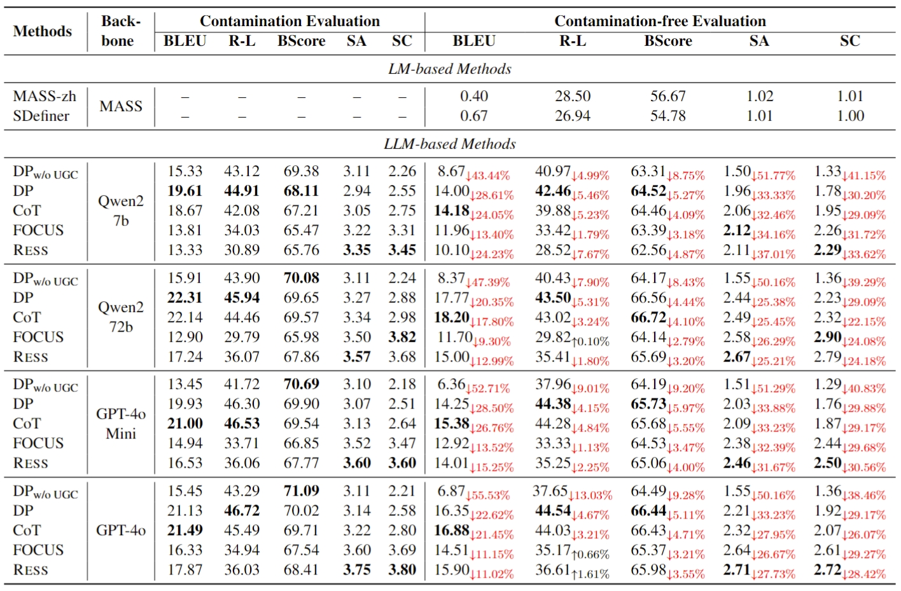

## Can Large Language Models Understand Internet Buzzwords Through User-Generated Content
> Accepted by ACL 2025 (Main)

**Paper Link**: [our paper](https://www.arxiv.org/abs/2505.15071)


### Dataset
> The datasets(raw and filtered) are stored in folder *./data/data_cheating_filtered.py* is the final version.

#### Here's the format & stat. of our data:
```json
"流行词名字": {
"examples": "例句",
"definition": "定义",
"ground_truth": "流行词介绍",
        
"Gemini_15_pro_KEY": "Gemini 1.5 Pro对该词的定义（没有使用例句的情况）",
"Gemini_15_flash_KEY": "Gemini 1.5 Flash对该词的定义（没有使用例句的情况）",
"Qwen2_7b_KEY": "Qwen2 7b对该词的定义（没有使用例句的情况）",
"Qwen2_72b_KEY": "Qwen2 72b对该词的定义（没有使用例句的情况）"
"GPT_4o_KEY": "GPT_4o对该词的定义（没有使用例句的情况）",
"GPT_4o_mini_KEY": "GPT_4o_mini对该词的定义（没有使用例句的情况）",
        
"Gemini_15_pro_KEY_score": "LLM对Gemini_15_pro_KEY定义的评价", 
"Gemini_15_flash_KEY_score": "LLM对Gemini_15_flash_KEY定义的评价", 
"Qwen2_7b_KEY_score": "LLM对Qwen2_7b_KEY定义的评价", 
"Qwen2_72b_KEY_score": "LLM对Qwen2_72b_KEY定义的评价", 
"GPT_4o_KEY_score": "LLM对GPT_4o_KEY定义的评价", 
"GPT_4o_mini_KEY_score": "LLM对GPT_4o_mini_KEY定义的评价", 

}
```


### File Structure
> **./main.py:** Entry point and framework of our algorithm.
> 
> **./dataUtil.py** Used to process the raw data and load data
>
> **./ToolUtil.py** Contains code for evaluation
>
> **./Agent** LLM agents
>
> **./baselines** Code for Focus
>
> **./classifier_and_its_attachments** Code for sentence method "waus"(see appendix)
>
> **./data** Stores our dataset(raw and filtered)

### Quick Start
#### 1. Install the necessary requirements
#### 2. Run the following code:
`python main.py`

#### 3. There are three parameters to set:
    sentence_method: "all", "random", "waus", "gdex"
    backbone_method: "Qwen/Qwen2-7B-Instruct", "Qwen/Qwen2-72B-Instruct", "gpt-4o", "gpt-4o-mini"
    top_k: 50 by default

### Benchmark Results


### Reference
If you make advantage of our paper, please cite the following in your manuscript:

```
@inproceedings{buzz2025huang,
  title={Can Large Language Models Understand Internet Buzzwords Through User-Generated Content},
  author={Chen Huang, Junkai Luo, Xinzuo Wang, Wenqiang Lei, Jiancheng Lv},
  booktitle = {Annual Meeting of the Association for Computational Linguistics},
  year      = {2025}
}
```
